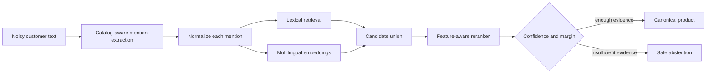

# Dirty Product Linker

[](https://github.com/ofeliacode/dirty-product-linker/actions/workflows/ci.yml)
[](https://ofeliacode.github.io/dirty-product-linker/)
[](https://dirty-product-linker-api.onrender.com/health)

Product entity linking for noisy Russian, English, and transliterated shopping text.
The system resolves slang, abbreviations, misspellings, and model aliases to canonical
catalog records, while abstaining when the evidence is insufficient.

**[Try the live demo](https://ofeliacode.github.io/dirty-product-linker/)** ·
**[Open the API](https://dirty-product-linker-api.onrender.com/docs)** ·
**[Read the architecture](SPEC.md)**

```text
"ищу 15pm на 256"
              ↓
apple-iphone-15-pro-max-256-black · confidence 0.82 · lexical-v0.2
```

## Architecture



The repository contains a reproducible data pipeline, frozen benchmark, several
retrieval baselines, an explainable feature-aware reranker, a FastAPI inference API,
CLI, Docker deployment, CI quality gates, and a lightweight React demonstration.

| Layer | Implementation |
| --- | --- |
| Contracts | Versioned Pydantic schemas and validated JSONL |
| Retrieval | Character/token lexical matching and multilingual MiniLM |
| Decision | Explainable catalog features, candidate reranking, abstention |
| Interfaces | Python, `product-linker` CLI, FastAPI, React |
| Delivery | Docker, Render Blueprint, GitHub Pages, GitHub Actions |

## Measured results

| Evaluation | End-to-end | Accepted precision | Coverage |
| --- | ---: | ---: | ---: |
| Frozen 20-query lexical seed benchmark | 0.800 | 1.000 | 0.550 |
| 25-query semantic development set, feature reranker | 0.920 | 1.000 | 0.720 |

The second row is a **synthetic development result**, not an unbiased final test
claim. The public free deployment uses the lightweight lexical runtime. Its
`confidence` field is a decision score, not a calibrated probability. See
[the lexical evaluation](docs/lexical-baseline.md) and
[reranker methodology](docs/feature-reranker.md) for limitations and error analysis.

The multi-product rule baseline reaches exact span F1 `0.909` and end-to-end mention
accuracy `0.833` on a pinned 25-query **synthetic candidate set**. It preserves
precision `1.000` but gets `0.000` recall on deliberately unseen wording. These are
development diagnostics, not final holdout claims. See the
[multi-product evaluation](docs/multi-product-evaluation.md).
The candidate set can only be promoted after completing the
[human review checklist](docs/multi-product-review-checklist.md); the guarded command
records reviewer attestation and refuses to overwrite frozen data.
Version v0.1 has now been reviewed and frozen with provenance
`human_reviewed_synthetic_origin`. It is suitable for audited baseline comparison,
but the final generalization claim still requires a new human-authored holdout that
was not inspected during development.

## API example

```bash
curl -X POST https://dirty-product-linker-api.onrender.com/v1/link \
  -H 'Content-Type: application/json' \
  -d '{"text":"ищу 15pm на 256"}'
```

Extract and independently link multiple explicit mentions while preserving their
half-open character offsets:

```bash
curl -X POST https://dirty-product-linker-api.onrender.com/v1/extract-and-link \
  -H 'Content-Type: application/json' \
  -d '{"text":"нужен айфон 15 про макс и наушники sony xm5"}'
```

The response includes the selected product, ranked candidates, matched surface,
decision reason, latency, model version, and catalog version. A query such as
`виво` returns `brand_not_in_catalog` instead of inventing a SKU.

The multi-product extractor is a high-precision rule baseline. It recognizes only
explicit catalog models and aliases, selects the longest non-overlapping surfaces,
and may miss unseen wording. This establishes a measurable baseline for a future
token-classification NER model without presenting rules as trained NER.

## Current verification

Create a Python 3.12 virtual environment and install the development dependencies:

```bash
python3 -m venv .venv
.venv/bin/python -m pip install -e '.[api,data,embeddings,dev]'
PYTHONPATH=src .venv/bin/pytest
.venv/bin/ruff check .
.venv/bin/mypy src
```

The sample catalog is intentionally small. It validates the format and category
coverage; it is not used to claim model quality.

## Run the interactive demo

The default runtime executes normalization, lexical retrieval, multilingual MiniLM
retrieval, feature-aware reranking, and conservative abstention. The pinned model is
loaded lazily on the first prediction and then reused. Start the API in the repository
root:

```bash
.venv/bin/uvicorn dirty_product_linker.api.app:app --reload
```

For an offline machine with the pinned model already in the Hugging Face cache:

```bash
DPL_OFFLINE=1 .venv/bin/uvicorn dirty_product_linker.api.app:app --reload
```

The dependency-free baseline remains available explicitly with `DPL_RUNTIME=lexical`.

In another terminal, install and start the React client:

```bash
cd web
npm install
npm run dev
```

Open `http://127.0.0.1:5173`. The Vite development server proxies `/v1` and `/health`
to FastAPI on port `8000`. The page supports both one-mention resolution and
multi-product extraction. It displays canonical records, confidence, exact source
offsets, matched aliases, candidates, catalog version, and request latency. API
documentation is available at
`http://127.0.0.1:8000/docs`.

Build the production frontend with:

```bash
cd web
npm run build
```

The same runtime is available as a machine-readable CLI:

```bash
product-linker predict "хочу 15pm на 256"
product-linker predict "ищу самсунь s24 ultra серый" --offline
product-linker predict "сони наушники xm5" --runtime lexical
```

The command prints JSON containing the decision status, canonical product and
category, confidence, candidate ranking, request latency, model version, and catalog
version. Full mode never silently falls back to lexical retrieval if model loading
fails.

## Deploy the public demo

The React client is deployed to GitHub Pages by
`.github/workflows/pages.yml`. Its production build targets the public API declared by
`VITE_API_URL` (the repository variable can override the default Render URL).

The root `render.yaml` and `Dockerfile` define a free Render web service. The free
deployment intentionally uses the dependency-free lexical runtime to stay within a
small CPU container; it does not claim the feature-reranker development metrics.
Create the service from the Blueprint at:

```text
https://render.com/deploy?repo=https://github.com/ofeliacode/dirty-product-linker
```

Render builds the container as a non-root user, injects its public `PORT`, checks
`/health`, and exposes the API at `https://dirty-product-linker-api.onrender.com`.
Free services sleep after inactivity, so the first request after a cold start can be
substantially slower. The GitHub Pages origin is explicitly included in the API CORS
allowlist.

## Import the public catalog source

The project includes a pinned, streaming importer for the Apache-2.0 Shopify Product
Catalogue:

```bash
PYTHONPATH=src .venv/bin/python scripts/import_shopify_catalog.py --limit 1000
```

It writes a validated local JSONL catalog and an audit report without committing the
downloaded data to Git. See [docs/source-data.md](docs/source-data.md) for provenance,
limitations, and the live smoke-test result.

Build a deterministic balanced release from the imported products:

```bash
PYTHONPATH=src .venv/bin/python scripts/build_catalog.py \
  --config configs/data/catalog_v1.yaml
```

The taxonomy, checkpoint/resume flow, deduplication, balanced selection, manifest,
and checksum process is documented in
[docs/catalog-building.md](docs/catalog-building.md). The pinned Shopify train scan
completed, but its supported output is heavily concentrated in home appliances; a
second licensed source is required before this catalog can serve as the five-category
benchmark matrix.

## Import query-product relevance judgments

Amazon ESCI is registered separately from the category catalog because it answers a
different question: how relevant is a product to a real shopping query? Import a
small, pinned, streaming sample of its training split with:

```bash
PYTHONPATH=src .venv/bin/python scripts/import_esci_queries.py --limit 1000
```

The importer preserves the ESCI label (Exact, Substitute, Complement, or Irrelevant),
locale, original IDs, source split, and source revision. The official test split is
intentionally blocked from this development-data command to prevent evaluation
leakage. ESCI has no product-category ground truth, so it is not used to fill gaps in
the five-category catalog.

## Build the Russian dirty-query benchmark

The repository includes the reviewed and frozen `ru-dirty-v0.1` seed benchmark:
20 examples covering dirty, ambiguous, and negative queries. The original AI-authored
candidates remain separately marked `synthetic`; the review attestation records their
promotion to human-reviewed data. The freeze command enforces human provenance,
catalog references, unique IDs, deterministic ordering, and checksums. See
[docs/benchmark-review.md](docs/benchmark-review.md) for the workflow and boundaries.

## Run the lexical baseline

The first dependency-free product linker normalizes noisy text and ranks catalog
models, families, and aliases with token and character n-gram similarity:

```bash
PYTHONPATH=src .venv/bin/python scripts/evaluate_lexical_baseline.py
```

On the frozen 20-example seed benchmark it measured Accuracy@1 `0.733`, negative
accuracy `1.000`, end-to-end accuracy `0.800`, accepted precision `1.000`, and
coverage `0.550`. These are seed results, not production claims. See
[docs/lexical-baseline.md](docs/lexical-baseline.md) for the full error analysis and
limitations.

Further lexical changes are developed only on the separate 24-example synthetic
development set. Compact model matching and weak-category filtering raised its
end-to-end score from `0.708` to `1.000`; this is a development result, not a new
unbiased test claim. See [docs/development-set.md](docs/development-set.md) for the
before/after experiment and evaluation boundary.

## Compare dense and lexical retrieval

An optional pinned multilingual MiniLM baseline compares 384-dimensional cosine
retrieval with lexical v0.2 on the same synthetic development set:

```bash
.venv/bin/python -m pip install -e '.[embeddings]'
HF_HUB_OFFLINE=1 PYTHONPATH=src .venv/bin/python \
  scripts/evaluate_embedding_development.py
```

Dense retrieval reached end-to-end `0.833` at p50 `15.869 ms`; lexical v0.2 reached
`1.000` at p50 `0.158 ms` in the same local run. This negative result is retained
because dense semantic similarity produced brand/category false positives. See
[docs/embedding-baseline.md](docs/embedding-baseline.md) for methodology, memory,
errors, and limitations.

## Hybrid decision policy

The experimental hybrid linker invokes dense retrieval only after lexical abstention
and requires score, margin, and lexical-agreement guards. On the current development
set it preserved end-to-end `1.000`, with 18 lexical decisions and 6 abstentions, but
recovered zero additional queries. Its p50 stayed near lexical at `0.17 ms`, while
p95 rose to `17.63 ms`. Dense fallback therefore remains disabled by default. See
[docs/hybrid-linker.md](docs/hybrid-linker.md) for the policy and architectural
decision.

## Harder catalog and semantic queries

Catalog v0.2 expands the demo matrix from 6 to 20 products, balanced across five
categories. On a new 25-query semantic development slice, dense retrieval finally
outperformed lexical end-to-end (`0.520` versus `0.240`), but accepted precision was
only `0.611`. The fixed guarded hybrid reached `0.280` with precision `0.750` and
recovered only one dense fallback. See
[docs/semantic-retrieval.md](docs/semantic-retrieval.md) for the complete experiment
and why a feature-aware reranker is the next justified component.

## Feature-aware reranking

The explainable reranker combines the lexical and dense top-5 lists with explicit
brand, category, model-token, and attribute evidence. On semantic development data
it reached Accuracy@1 `0.900`, negative accuracy `1.000`, end-to-end `0.920`, and
accepted precision `1.000` at coverage `0.720`. The two remaining errors were safe
abstentions. See [docs/feature-reranker.md](docs/feature-reranker.md) for weights,
per-candidate explanations, limitations, and next steps.
